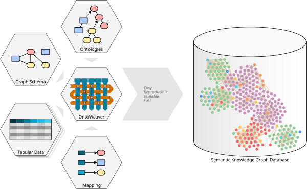

# Hands-on Building Graphs with OntoWeaver (offline mode) and Neo4j

## Overview

This tutorial introduces **OntoWeaver** as a practical way to build a semantic knowledge graph from tabular data and load it into **Neo4j**.

<p align="center">
  
</p>


OntoWeaver automates the creation of knowledge graphs from existing data. Instead of writing a full Python adapter manually, you describe the mapping between your input table and your graph model in a YAML file. OntoWeaver then generates the BioCypher adapter internally and uses BioCypher to create the backend output.

In this tutorial, we will use a synthetic protein interaction dataset and convert it into a graph where:

- proteins become nodes,
- protein-protein interactions become edges,
- interaction flags become properties,
- Neo4j import files are generated offline,
- the final graph can be queried in Neo4j Browser.

By the end of this tutorial, you will be able to:

- set up an OntoWeaver project,
- prepare input data,
- write an OntoWeaver mapping,
- create a schema for the graph,
- configure Neo4j offline output,
- generate Neo4j import files,
- import the graph into Neo4j,
- validate the graph using Cypher queries.

---

## Pre-requisites

| Tool | Version/Requirement | Installation Link | Notes |
|------|-------------------|------------------|------|
| Git | Any | Git Docs | For version control |
| Neo4j | 5.x or newer | Neo4j Desktop or a local Neo4j install | For querying graphs |
| uv | >=0.7.x | uv Docs | For dependency management |
| Python | >= 3.11 | Python.org | Required for BioCypher |
| Jupyter (optional) | Any | Jupyter | Required for exploring the sample data |

!!! note
    The table above intentionally follows the same format and wording as the BioCypher-style tutorial requirement table.

---

## What OntoWeaver does

OntoWeaver is designed to create semantic knowledge graphs from heterogeneous data sources. The central idea is simple:

```text
input data + mapping YAML + graph configuration
        ↓
OntoWeaver
        ↓
BioCypher adapter generated automatically
        ↓
Neo4j / CSV / RDF / PostgreSQL / SQLite / NetworkX output
```

The important part for the user is the **mapping file**.

Instead of manually writing Python code that yields nodes and edges, you write a YAML mapping that says:

- which column represents the subject node,
- which column becomes another node,
- which edge connects the subject and object,
- which columns become node or edge properties,
- which metadata should be added.

This makes OntoWeaver useful when you want to quickly test graph structures from tabular data.

---

## Tutorial example

We will use a simple protein interaction table.

The table contains source proteins, target proteins, and interaction indicators. A row can be understood as:

```text
source protein  ── interacts with ──>  target protein
```

Some rows also describe the type of interaction:

- stimulation,
- inhibition,
- phosphorylation,
- ubiquitination,
- binding.

The resulting graph will contain:

```text
(:protein)-[:protein_protein_interaction]->(:protein)
```

and optionally more specific relationships such as:

```text
(:protein)-[:activation]->(:protein)
(:protein)-[:inhibition]->(:protein)
(:protein)-[:phosphorylation]->(:protein)
(:protein)-[:ubiquitination]->(:protein)
(:protein)-[:binding]->(:protein)
```

---

## Project setup

Create a clean project folder:

```bash
mkdir tutorial-ontoweaver-neo4j
cd tutorial-ontoweaver-neo4j
```

Create the folder structure:

```bash
mkdir -p config data/in notebooks
```

Your project will eventually look like this:

```text
tutorial-ontoweaver-neo4j/
├── config/
│   ├── biocypher_config.yaml
│   ├── schema_config.yaml
│   └── protein_interactions_mapping.yaml
├── data/
│   └── in/
│       └── synthetic_protein_interactions.tsv
├── notebooks/
└── README.md
```

---

## Installing OntoWeaver

There are two common ways to install OntoWeaver.

### Option 1 — install from PyPI

This is the simplest option for a normal tutorial project:

```bash
python -m venv .venv
source .venv/bin/activate

pip install ontoweaver pandas
```

On macOS, if your default `python` points to Python 2 or an old Python version, use:

```bash
python3 -m venv .venv
source .venv/bin/activate

pip install ontoweaver pandas
```

Check that the command is available:

```bash
ontoweave --help
```

---

### Option 2 — install from the GitHub repository

Clone the OntoWeaver repository:

```bash
git clone https://github.com/oncodash/ontoweaver.git
cd ontoweaver
```

Create the environment:

```bash
uv venv
```

Install dependencies:

```bash
uv sync
```

Run the command:

```bash
uv run ontoweave --help
```

If needed, you can also use:

```bash
uv run ./src/ontoweaver/ontoweave --help
```

!!! tip
    If you are working inside the cloned OntoWeaver repository, use `uv run ontoweave`.
    If you installed OntoWeaver into your own virtual environment, use `ontoweave`.

---

## Get the data

Download the synthetic protein interaction dataset:

```bash
curl -L -o data/in/synthetic_protein_interactions.tsv \
https://zenodo.org/records/16902349/files/synthetic_protein_interactions.tsv
```

Check that the file exists:

```bash
ls -lh data/in/
```

You should see:

```text
synthetic_protein_interactions.tsv
```

---

## Explore the data

This step is optional but useful.

Create a notebook or a small script:

```python
import pandas as pd

df = pd.read_table("data/in/synthetic_protein_interactions.tsv")

print(df.head())
print(df.columns)
print(df.info())
print(df.isnull().sum())
```

Expected columns may include fields like:

```text
source
target
source_genesymbol
target_genesymbol
type
is_directed
is_stimulation
is_inhibition
is_phosphorylation
is_ubiquitination
is_binding
```

Count unique proteins:

```python
all_proteins = set(df["source"]).union(set(df["target"]))
print("Number of unique proteins:", len(all_proteins))
print("Number of interactions:", len(df))
```

Check interaction columns:

```python
interaction_columns = [
    "is_stimulation",
    "is_inhibition",
    "is_phosphorylation",
    "is_ubiquitination",
    "is_binding",
]

print(df[interaction_columns].sum())
```

!!! warning
    If your dataset has slightly different column names, update the mapping YAML accordingly.
    OntoWeaver mappings depend directly on column names.

---

## Understand the graph model

Before writing the mapping, decide what your graph should look like.

For this tutorial:

| Input column | Graph role |
|---|---|
| `source` | subject protein node |
| `target` | object protein node |
| `source_genesymbol` | source protein property |
| `target_genesymbol` | target protein property |
| `type` | interaction property |
| `is_directed` | interaction property |
| `is_stimulation` | interaction property / activation edge condition |
| `is_inhibition` | interaction property / inhibition edge condition |
| `is_phosphorylation` | interaction property / phosphorylation edge condition |
| `is_ubiquitination` | interaction property / ubiquitination edge condition |
| `is_binding` | interaction property / binding edge condition |

The basic graph pattern is:

```text
protein(source) ── protein protein interaction ──> protein(target)
```

---

## Create the OntoWeaver mapping

Create the file:

```bash
touch config/protein_interactions_mapping.yaml
```

Add the following mapping:

```yaml
row:
  map:
    column: source
    to_subject: protein

transformers:
  - map:
      column: target
      to_object: protein
      via_relation: protein protein interaction

  - map:
      column: source_genesymbol
      to_property: genesymbol
      for_object: protein

  - map:
      column: type
      to_property: interaction_type
      for_object: protein protein interaction

  - map:
      column: is_directed
      to_property: is_directed
      for_object: protein protein interaction

  - map:
      column: is_stimulation
      to_property: is_stimulation
      for_object: protein protein interaction

  - map:
      column: is_inhibition
      to_property: is_inhibition
      for_object: protein protein interaction

  - map:
      column: is_phosphorylation
      to_property: is_phosphorylation
      for_object: protein protein interaction

  - map:
      column: is_ubiquitination
      to_property: is_ubiquitination
      for_object: protein protein interaction

  - map:
      column: is_binding
      to_property: is_binding
      for_object: protein protein interaction

metadata:
  - source: "Synthetic protein interaction dataset"
  - version: "tutorial-example"
```

---

## Mapping explanation

The first part defines the subject of each row:

```yaml
row:
  map:
    column: source
    to_subject: protein
```

This means:

```text
For each row, take the value in the source column and create/map it as a protein node.
```

The next transformer creates a target protein and connects it to the source protein:

```yaml
- map:
    column: target
    to_object: protein
    via_relation: protein protein interaction
```

This means:

```text
Take the target column, create/map it as another protein node, and connect source → target with a protein protein interaction edge.
```

Property transformers attach values to nodes or edges:

```yaml
- map:
    column: is_directed
    to_property: is_directed
    for_object: protein protein interaction
```

This means:

```text
Take the is_directed column and store it as a property on the interaction edge.
```

---

## Optional: specific interaction relationships

The basic mapping above creates a general interaction edge.

If you also want specific edges such as activation, inhibition, phosphorylation, ubiquitination, and binding, you can extend the mapping:

```yaml
row:
  map:
    column: source
    to_subject: protein

transformers:
  - map:
      column: target
      to_object: protein
      via_relation: protein protein interaction

  - map:
      column: target
      to_object: protein
      via_relation: activation
      match:
        - "1":
            column: is_stimulation

  - map:
      column: target
      to_object: protein
      via_relation: inhibition
      match:
        - "1":
            column: is_inhibition

  - map:
      column: target
      to_object: protein
      via_relation: phosphorylation
      match:
        - "1":
            column: is_phosphorylation

  - map:
      column: target
      to_object: protein
      via_relation: ubiquitination
      match:
        - "1":
            column: is_ubiquitination

  - map:
      column: target
      to_object: protein
      via_relation: binding
      match:
        - "1":
            column: is_binding

  - map:
      column: source_genesymbol
      to_property: genesymbol
      for_object: protein

  - map:
      column: type
      to_property: interaction_type
      for_object: protein protein interaction

  - map:
      column: is_directed
      to_property: is_directed
      for_object: protein protein interaction
```

!!! note
    Use this extended version if you want separate Neo4j relationship types for each interaction category.

---

## Create the schema

Create:

```bash
touch config/schema_config.yaml
```

Add:

```yaml
protein:
  represented_as: node
  preferred_id: uniprot
  input_label: protein
  properties:
    genesymbol: str

protein protein interaction:
  represented_as: edge
  input_label: protein protein interaction
  properties:
    interaction_type: str
    is_directed: bool
    is_stimulation: bool
    is_inhibition: bool
    is_phosphorylation: bool
    is_ubiquitination: bool
    is_binding: bool

activation:
  is_a: protein protein interaction
  represented_as: edge
  input_label: activation
  inherit_properties: true

inhibition:
  is_a: protein protein interaction
  represented_as: edge
  input_label: inhibition
  inherit_properties: true

phosphorylation:
  is_a: protein protein interaction
  represented_as: edge
  input_label: phosphorylation
  inherit_properties: true

ubiquitination:
  is_a: protein protein interaction
  represented_as: edge
  input_label: ubiquitination
  inherit_properties: true

binding:
  is_a: protein protein interaction
  represented_as: edge
  input_label: binding
  inherit_properties: true
```

!!! tip
    OntoWeaver can generate schemas automatically with `--auto-schema`.
    A hand-written schema is useful when you want more control over labels, hierarchy, and properties.

---

## Configure BioCypher / Neo4j output

OntoWeaver uses BioCypher underneath for graph output, so we need a BioCypher configuration file.

Create:

```bash
touch config/biocypher_config.yaml
```

Add:

```yaml
biocypher:
  offline: true
  debug: false
  schema_config_path: config/schema_config.yaml
  cache_directory: .cache

neo4j:
  database_name: neo4j
  delimiter: '\t'
  array_delimiter: '|'
  skip_duplicate_nodes: true
  skip_bad_relationships: true
  import_call_bin_prefix: /PATH/TO/NEO4J/bin/
```

Replace:

```text
/PATH/TO/NEO4J/bin/
```

with the path to your Neo4j `bin` folder.

Example macOS path may look like:

```text
/Users/yourname/Library/Application Support/Neo4j Desktop/Application/relate-data/dbmss/dbms-xxxx/bin/
```

Example Linux path may look like:

```text
/var/lib/neo4j/bin/
```

---

## Run OntoWeaver with an explicit schema

Run:

```bash
ontoweave \
  --biocypher-config config/biocypher_config.yaml \
  --biocypher-schema config/schema_config.yaml \
  data/in/synthetic_protein_interactions.tsv:config/protein_interactions_mapping.yaml
```

If you installed from the repository using `uv`, run:

```bash
uv run ontoweave \
  --biocypher-config config/biocypher_config.yaml \
  --biocypher-schema config/schema_config.yaml \
  data/in/synthetic_protein_interactions.tsv:config/protein_interactions_mapping.yaml
```

OntoWeaver should generate output in:

```text
biocypher-out/<timestamp>/
```

---

## Run OntoWeaver with auto-schema

If you do not want to write the full schema manually, use:

```bash
ontoweave \
  --biocypher-config config/biocypher_config.yaml \
  --auto-schema config/autoschema.yaml \
  data/in/synthetic_protein_interactions.tsv:config/protein_interactions_mapping.yaml
```

This asks OntoWeaver to generate a schema file from the mapping.

With `uv`:

```bash
uv run ontoweave \
  --biocypher-config config/biocypher_config.yaml \
  --auto-schema config/autoschema.yaml \
  data/in/synthetic_protein_interactions.tsv:config/protein_interactions_mapping.yaml
```

After running, inspect:

```bash
cat config/autoschema.yaml
```

---

## Output structure

After running OntoWeaver, check:

```bash
ls biocypher-out/
```

Then inspect the newest output folder:

```bash
ls biocypher-out/<timestamp>/
```

Typical files include:

```text
Protein-header.csv
Protein-part000.csv
ProteinProteinInteraction-header.csv
ProteinProteinInteraction-part000.csv
neo4j-admin-import-call.sh
```

If you used the extended mapping, you may also see files for:

```text
Activation
Inhibition
Phosphorylation
Ubiquitination
Binding
```

The exact file names may depend on schema labels and BioCypher formatting.

---

## Import into Neo4j manually

Stop Neo4j first:

```bash
/path/to/neo4j/bin/neo4j stop
```

Run the generated import script:

```bash
bash biocypher-out/<timestamp>/neo4j-admin-import-call.sh
```

Start Neo4j:

```bash
/path/to/neo4j/bin/neo4j start
```

In current Neo4j versions, the `neo4j` command maps to the same server controls:

```bash
neo4j-admin server stop
neo4j-admin server start
```

---

## Import into Neo4j automatically

OntoWeaver can also run the generated import script for you:

```bash
ontoweave \
  --biocypher-config config/biocypher_config.yaml \
  --biocypher-schema config/schema_config.yaml \
  data/in/synthetic_protein_interactions.tsv:config/protein_interactions_mapping.yaml \
  --import-script-run
```

Or with `uv`:

```bash
uv run ontoweave \
  --biocypher-config config/biocypher_config.yaml \
  --biocypher-schema config/schema_config.yaml \
  data/in/synthetic_protein_interactions.tsv:config/protein_interactions_mapping.yaml \
  --import-script-run
```

---

## Query the graph in Neo4j

Open Neo4j Browser and run:

```cypher
MATCH (n)
RETURN n
LIMIT 25;
```

Show proteins:

```cypher
MATCH (p:protein)
RETURN p
LIMIT 25;
```

Show all relationships:

```cypher
MATCH (a)-[r]->(b)
RETURN a, r, b
LIMIT 50;
```

Count nodes by label:

```cypher
MATCH (n)
RETURN labels(n) AS labels, count(*) AS count
ORDER BY count DESC;
```

Count relationships by type:

```cypher
MATCH ()-[r]->()
RETURN type(r) AS relationship_type, count(*) AS count
ORDER BY count DESC;
```

Find activation edges:

```cypher
MATCH (a)-[r:activation]->(b)
RETURN a, r, b
LIMIT 25;
```

Find inhibition edges:

```cypher
MATCH (a)-[r:inhibition]->(b)
RETURN a, r, b
LIMIT 25;
```

---

## Using multiple input files

OntoWeaver can process multiple data files with mappings:

```bash
ontoweave \
  data_A.csv:map_A.yaml \
  data_B.tsv:map_B.yaml
```

With `uv`:

```bash
uv run ontoweave \
  data_A.csv:map_A.yaml \
  data_B.tsv:map_B.yaml
```

You can also use the same mapping for multiple files:

```bash
ontoweave \
  data/in/interactions_part_1.tsv:config/protein_interactions_mapping.yaml \
  data/in/interactions_part_2.tsv:config/protein_interactions_mapping.yaml
```

---

## Using glob patterns

For file groups, use quoted glob syntax:

```bash
ontoweave 'data/in/*.tsv:config/protein_interactions_mapping.yaml'
```

!!! warning
    Keep the glob pattern in quotes.
    Otherwise your shell may expand the files before OntoWeaver receives the pattern.

---

## Validation checklist

After creating the graph, validate:

- Did the expected number of protein nodes appear?
- Did the expected number of interaction edges appear?
- Are interaction properties present?
- Are the labels correct?
- Are source and target nodes connected correctly?
- Are there duplicate nodes?
- Are there missing values in important columns?

Useful Cypher checks:

```cypher
MATCH (p:protein)
RETURN count(p);
```

```cypher
MATCH ()-[r]->()
RETURN count(r);
```

```cypher
MATCH (a)-[r]->(b)
RETURN a, type(r), properties(r), b
LIMIT 20;
```

---

## Troubleshooting

### `ontoweave: command not found`

If installed with `pip`, activate the environment:

```bash
source .venv/bin/activate
```

Then try:

```bash
ontoweave --help
```

If using the cloned repository:

```bash
uv run ontoweave --help
```

---

### Column not found

If you see an error about a missing column, inspect your TSV:

```python
import pandas as pd
df = pd.read_table("data/in/synthetic_protein_interactions.tsv")
print(df.columns.tolist())
```

Then update `config/protein_interactions_mapping.yaml`.

---

### Neo4j import fails

Common causes:

- Neo4j is still running during offline import.
- `import_call_bin_prefix` points to the wrong folder.
- The target database already contains data.
- Java version is incompatible with your Neo4j version.
- File permissions prevent execution of the import script.

Try:

```bash
chmod +x biocypher-out/<timestamp>/neo4j-admin-import-call.sh
```

Then rerun:

```bash
bash biocypher-out/<timestamp>/neo4j-admin-import-call.sh
```

---

### No relationship files are generated

Check:

- `via_relation` is defined in the mapping.
- The relation name matches the schema `input_label`.
- The target column is not empty.
- The mapping file indentation is valid YAML.

---

## Complete minimal file set

At minimum, the project needs:

```text
config/
├── biocypher_config.yaml
├── schema_config.yaml
└── protein_interactions_mapping.yaml

data/in/
└── synthetic_protein_interactions.tsv
```

Run command:

```bash
ontoweave \
  --biocypher-config config/biocypher_config.yaml \
  --biocypher-schema config/schema_config.yaml \
  data/in/synthetic_protein_interactions.tsv:config/protein_interactions_mapping.yaml
```

---

## Summary

In this tutorial, you:

- created a project folder,
- installed OntoWeaver,
- downloaded a protein interaction dataset,
- explored the input table,
- defined a YAML mapping,
- created a graph schema,
- configured Neo4j offline output,
- generated Neo4j import files,
- imported the graph into Neo4j,
- queried and validated the result.

OntoWeaver is useful because it lets you build semantic knowledge graphs from existing data with much less custom Python code. The main work becomes designing a clear mapping between your table and your desired graph model.

---

## Next steps

You can extend this tutorial by:

- adding more biological datasets,
- using multiple mapping files,
- adding richer metadata,
- exporting to RDF,
- using JSON or XML inputs,
- writing custom transformers for more complex transformations,
- comparing different graph structures quickly.

